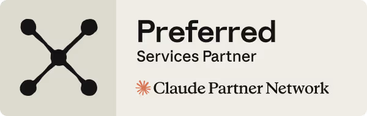

<p align="center">
  <a href="https://cfgauss.com.br">
    
  </a>
</p>

<p align="center">
  
</p>

<p align="center">
  <strong>I build open-source marketing infrastructure: the landing-page engine, the email cockpit and the tracking layer — one contract, three skills, one funnel.</strong>
</p>

<p align="center">
  <a href="https://github.com/luisroquette"></a>
  <a href="https://github.com/luisroquette?tab=repositories"></a>
  <a href="https://github.com/luisroquette/My_UTMs_Make_Me_Proud/blob/main/LICENSE"></a>
  
</p>

---

## About me

I am an **Anthropic Select Services Partner** and the builder behind the CF Gauss marketing stack. I spent years building production systems — landing pages that convert, email engines that follow up without becoming spam, tracking that attributes every sale to its channel — and then extracted each one into a portable, deterministic, MIT-licensed skill that any Claude Code or Codex user can clone and run.

The three skills form one funnel: the **LP engine** captures leads from evidence-backed pages, the **email cockpit** nurtures them under a shared throttle (one email per lead per day, guaranteed by a test suite), and the **tracking layer** attributes every CTA back to its channel. They interoperate through contracts — the tracking link owns the definition of a click; the others reference it. No vendor lock-in, no black box: every rule ships as Markdown contracts plus deterministic validators you can run in your terminal and your CI.

What I believe: marketing software should be **auditable** (the rules are prose you can read), **deterministic** (same input, same verdict, forever), and **honest** (absence is never zero, and anti-fabrication beats a pretty page). The repositories below are the reference implementations of that belief.

Previously: RocketLabs (applied AI systems and developer tools), Resuma, NotchAgent and other product experiments — the same discipline, different surfaces. Everything here follows one visual and engineering standard: auditable contracts, deterministic validators, honest metrics.

---

## Achievements

<p align="center">
  
  
  
</p>

Earned the way achievements should be earned — by merging, reviewing and shipping.
---

## Quickstart

```bash
# The tracking layer — every marketing link, tracked and attributable
git clone https://github.com/luisroquette/My_UTMs_Make_Me_Proud.git

# The landing-page engine — brief, create, audit and publish
git clone https://github.com/luisroquette/My_LP_Makes_Neil_Proud.git

# The email cockpit — throttle, dispatcher, outbox and dashboard
git clone https://github.com/luisroquette/My_MailMKT_makes_Neil_Proud.git
```

All three are MIT, zero runtime dependencies, with deterministic validators and regression suites — clone one or clone all three.

---

## Flagship projects

| Project | What it is | Highlights |
|---|---|---|
| [**My_UTMs_Make_Me_Proud**](https://github.com/luisroquette/My_UTMs_Make_Me_Proud) | The tracking layer — creation, click, attribution, health and metrics as one auditable cycle | 13 regression cases · query-free destinations · SSRF-guarded health · first/last click attribution |
| [**My_LP_Makes_Neil_Proud**](https://github.com/luisroquette/My_LP_Makes_Neil_Proud) | The landing-page engine — six models, four gates, anti-fabrication above everything | 6 LP models · 12-criterion audit rubric · publication gate never bypassed |
| [**My_MailMKT_makes_Neil_Proud**](https://github.com/luisroquette/My_MailMKT_makes_Neil_Proud) | The email cockpit — shared throttle, single dispatcher, durable outbox, dashboard demo | 107 tests · 1 email/lead/day guaranteed · 5 motors, 1 cron · cockpit demo |
| [**RocketLabs**](https://github.com/luisroquette/RocketLabs) | Applied AI systems and developer tools — the earlier product era | Resuma, NotchAgent and content automation |

Deep dives: every repo's README documents the contracts in depth — the regression ledgers, the models, the gates, the fidelity rules. Start with the one that matches your layer of the funnel.

---

## Tech stack

### AI & Agents

[](https://claude.com/claude-code)
[](https://openai.com/codex)
[](https://docs.anthropic.com)
[](https://openai.com)
[](https://higgsfield.ai)
[](https://modelcontextprotocol.io)

### Marketing & Data

[](https://dataforseo.com)
[](https://developers.facebook.com)
[](https://developers.facebook.com/docs/instagram-platform)
[](https://business.whatsapp.com)
[](https://core.telegram.org/bots/api)
[](https://developer.x.com)

### Languages & Web

[](https://www.typescriptlang.org)
[](https://www.python.org)
[](https://nextjs.org)
[](https://react.dev)
[](https://tailwindcss.com)
[](https://ui.shadcn.com)
[](https://vite.dev)

### Infrastructure & Quality

[](https://supabase.com)
[](https://www.postgresql.org)
[](https://resend.com)
[](https://vercel.com)
[](https://vitest.dev)
[](https://playwright.dev)
[](https://ffmpeg.org)

---

## Connect

[](https://cfgauss.com.br)
[](https://github.com/luisroquette)

<p align="center">
  
</p>

<p align="center">
  <sub>CF Gauss · applied AI systems · open-source marketing infrastructure · MIT everywhere</sub>
</p>
